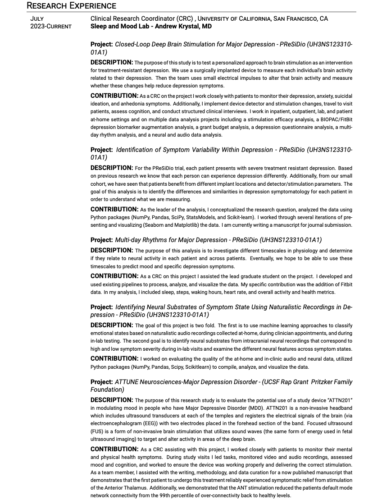

***

Updated Feb 2025 \
[a pdf version](pdfs/ATM_CV.pdf)

***

<!-- ### Education -->

<!--  - Sep 2014–May 2018: _B.A._, Psychology & Economics with honors, Skidmore College. Advisor: __Daniel Peterson__  -->

<!--  - Jan 2017–May 2017: _B.A._, Psychology, Exchange Program, Universidad Autónoma de Madrid. Advisor: __Susan Sánchez Casal__  -->

<!--  - Aug 2003–May 2012: _Student and Dancer_, Classical Ballet, San Francisco Ballet School. Head of School: __Lola De Ávila__  -->

<!-- *** -->

<!-- ### Research Experience -->

<!--  - May 2018–Current: _Lab Manager_, The Kuhl Lab. Psychology Department, University of Oregon. PI: __Brice Kuhl__ -->

<!--  - Sep 2017–May 2018: _Lab Manager_, Memory and Learning Sciences Lab. Psychology Department, Skidmore College. PI: __Daniel Peterson__ -->

<!--  - Jun 2017–Aug 2017: _Undergraduate Summer Research Assistant_, Brain and Memory Lab. Psychology Department, University of Oregon. PI: __Dasa Zeithamova__ -->

<!--  - Jun 2017–Aug 2017: _Undergraduate Summer Research Assistant_, The Kuhl Lab. Psychology Department, University of Oregon. PI: __Brice Kuhl__ -->

<!--  - Sep 2016–Dec 2017: _Undergraduate Research Assistant_, The Berger Lab. Psychology Department, Skidmore College. PI: __Lauren Berger__ -->

<!-- *** -->

<!-- ### Clinical Experience -->

<!--  - Jan 2017–May 2017: _Volunteer_, Asociación Española Contra Cáncer. Hospital Infanta Sofía, Madrid, Spain. Supervisor: __Patricia Predera__ -->

<!-- *** -->

<!-- ### Publications -->

<!--  - Chanales, A.J.H., __Tremblay-Mcgaw,A.G.__, & Kuhl, B.A. (in preparation). Similarities between memories trigger repulsion of their feature values. -->

<!-- *** -->

<!-- ### Posters -->

<!--  - Drascher, M.L., __Tremblay-McGaw, A.G.__, & Kuhl, B.A. (2019, October). Something. Poster session -->
<!-- XX presenting at the _Annual Society for Neuroscience, Chicago, IL._ -->

<!--  - __Tremblay-McGaw, A.G.__, Kuhl, B.A., & Long, N.M. (2019, March).Decoding biases between memory -->
<!-- encoding and retrieval induced by recent experience. Poster session A presented at the _Annual Cognitive -->
<!-- Neuroscience Society, San Francisco, CA._ -->

<!--  - __Tremblay-McGaw, A.G.__, Wissman, K.T., & Peterson, D.J. (2018, November). The Integration of -->
<!-- Memories in the Human Brain. Poster session IV presented at the _Annual Psychonomic Society, -->
<!-- New Orleans, LA._ -->

<!-- *** -->

<!-- ### Honors and Awards -->

<!--  - 2018             Mary Shafer Dennis Endowed Scholarship __Skidmore College__ -->
<!--  - 2017             Foley Psychology Department Research Fund __Skidmore College__ (USD $300) -->
<!--  - 2017             See Beyond Award __Skidmore College__ (USD $4,000) -->
<!--  - 2015,2016,2017   Dean’s List Honors __Skidmore College__ -->
<!--  - 2010-2014        Scholarship to attend __Drew High School__ (USD $128,000) -->
<!--  - 2003-2012        Full scholarship to attend the __San Francisco Ballet School__ (USD $100,000) -->
