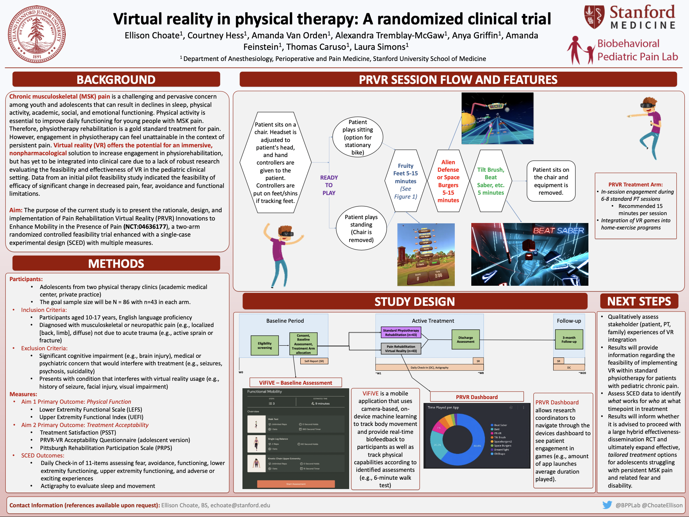
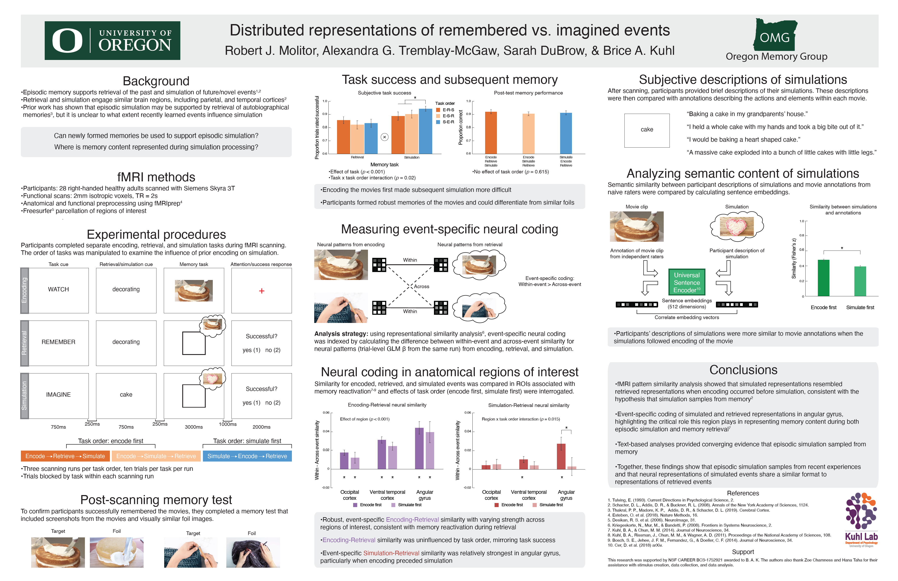
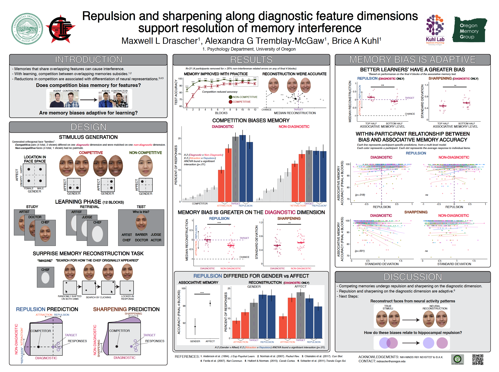
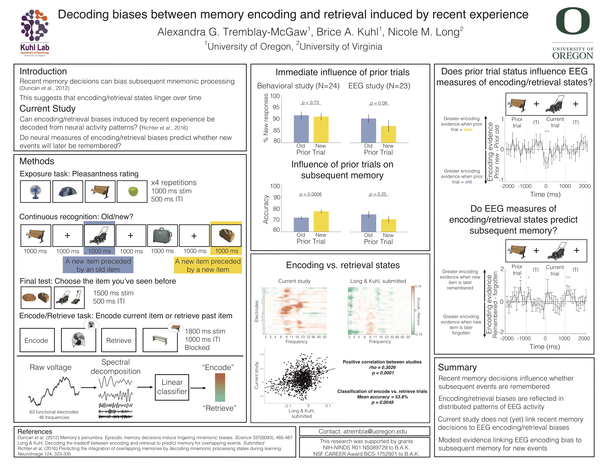

***

### IASP World Congress on Pain 2022 - Toronto, Canada

### Coming Soon!

***

### IASP World Congress on Pain 2022 - Toronto, Canada

### Coming Soon!

***

### Psychological Science Annual Convention 2022 - Chicago, IL

### Coming Soon!

__Introduction__: Chronic pain is associated with widespread neuroplasticity, which may play a crucial role in maintaining the disorder. Previous research in adults has identified white matter alterations in several chronic pain types - even predicting chronification. However, these studies are lacking in youths, yet necessary to understand how structural changes in pain-related networks occur and persist into adulthood. In this study, we examined white matter microstructure in a pediatric pain population, and explored how this microstructure relates to key individual differences, namely the level of experienced disability and pain-related catastrophic thinking. We implemented the multi-compartment modeling approach neurite orientation dispersion and density imaging (NODDI), shown to be more specific to the traditional diffusion tensor imaging (DTI) approach, deriving more biologically informative indices.

__Method__: 44 youths with chronic pain (age M±SD=15.8±0.4) and 24 pain-free controls (age M±SD=16.0±0.7) took part in an MRI study, which included a multi-shell diffusion-weighted imaging protocol (b-values=1000, 2000s/mm2). NODDI was used to obtain metrics for neurite orientation and density (ODI, NDI, respectively), and DTI to obtain fractional anisotropy (FA). Group comparisons were conducted on the voxel-level and tract-profile level using tract-based spatial statistics (TBSS) and automated fiber quantification (AFQ), respectively. Tracts which showed significant group-related differences were further examined to assess the relationship between the observed microstructure and individual difference factors: the Pain Catastrophizing Scale for Children (PCS-C) was used to assess catastrophic thinking about pain, including rumination, helplessness and magnification, while the Functional Disability Inventory (FDI) was used to assess perceived difficulties in performing activities due to pain.

__Results__: Voxel-based analyses showed widespread elevated ODI in patients compared to controls in several tracts, including bilateral corona radiata, superior longitudinal fasciculus, corticospinal tract, tracts going into pre- and postcentral gyrus, and left uncinate fasciculus. Higher ODI in the cluster encompassing right posterior corona radiata/cingulum was correlated with more pain catastrophizing (r = .33, p = .03) and with more pain-related disability (r = .32, p = .04). No other correlations or group differences in NDI or FA were observed. Tract-specific profile analyses also demonstrated ODI differences between youths with chronic pain and pain-free controls in several tracts, including sections of the uncinate fasciculus, corticospinal tract and forceps minor. Additionally, increased NDI was observed in sections of anterior thalamic radiation, cingulum and corticospinal tract. Higher ODI in the uncinate fasciculi as well as higher NDI in thalamic radiation and cingulum were associated with pain catastrophizing in patients. 

__Conclusion__: Overall, the analyses revealed widespread white matter microstructural differences in youth with chronic pain across tracts that have been implicated in sensory and cognitive-affective components of pain. Specifically, we observed differences in orientation dispersion, reflecting less coherence in the fiber bundles, which could be indicative of alterations or delays in axonal pruning processes, as well as increased density in several tracts, which could be indicative of increased myelination and may reflect a compensatory mechanism.

***

### Society for Pediatric Psychology Annual Conference 2022 - Pheonix, AZ

__Introduction:__ Physical activity is essential to improve daily functioning for chronic musculoskeletal (MSK) pain; however, fear of movement is a documented barrier to effective engagement in physical therapy (PT). Virtual reality (VR) as a supplemental to PT has been used as a tool to augment healthy outpatients undergoing PT. However, there is limited data analyzing the effectiveness of VR as a PT supplemental for patients with MSK pain. The current investigation compares VR guided PT to standard PT with three primary aims: (1) to evaluate physical function outcomes between VR guided PT to standard PT, (2) evaluate pain-related fear as a potential mechanism of change, (3) determine the feasibility of utilizing VR in routine PT practice. This RCT study will offer a yet to be tested advancement in VR technology, by providing new treatment solutions specifically targeted at movement facilitation by way of a nonpharmacological solution.
__Method:__ Participants with a history of chronic pain are recruited from several sites (academic medical center, managed care, private practice) within California in an effort to elicit a representative diverse participant population. Ages range from 10 to 17. Active treatment includes approximately eight one-hour VR-PT or standard PT sessions. VR sessions include real time tracking of movement to inform clinical decision-making and support tailored, point of care decisions. The primary outcome is physical function, and secondary outcome is pain-related fear. Both outcomes are assessed via daily check-in surveys and questionnaires. To assess changes in objective physical activity, participants wear actigraphy watches during their treatment period. Self-report questionnaires are completed at baseline, end of treatment, and 3-month follow-up.
__Results:__ Findings from our pilot feasibility trial provided sufficient promise to proceed with the current RCT. Results of the feasibility study indicate that across time, significant decreases in pain (F4,27.7=9.27, P<.001), fear (F4,25.7=5.17, P=0.003), avoidance (F4,27.9=4.96, P=.004), and functional limitations (F4,25.2=4.20, P=.01).
__Conclusion:__ Based on theory, previous research, and feasibility data, we expect participation in VR-PT to result in greater improvements in functioning compared to standard PT and that the magnitude of improvement will be associated with decreases in pain-related fear. Results of this study will provide key outcomes to evaluate this unique form of care and will inform whether it is advised to proceed with implementation of VR technology to address engagement in physical activity among youth with chronic MSK pain.

***

### Cognitive Neuroscience Society 2020 - Boston, MA (Virtual)

__Introduction__: Episodic memory is important for remembering the past and imagining novel or future events. This duality of memory is evidenced by neuroimaging work which has shown that similar brain regions are engaged during retrieval and memory-based construction of imagined events. Despite this link between retrieval and imagination, it is unclear to what extent representations of imagined events resemble representations of retrieved events. __Method__: Here, we used fMRI pattern similarity analyses to compare neural representations of retrieved and imagined events. Participants were scanned while watching videos, remembering previously viewed videos, and imagining novel events conceptually related to the content of watched and remembered videos. We first compared representations of retrieved events to representations of corresponding encoding events (i.e., watch trials). Critically, we contrasted this index of encoding- retrieval similarity to the similarity between conceptually-related retrieval and imagination trials. __Results__: Preliminary analyses (n = 8) revealed encoding-retrieval similarity (reinstatement) within visual cortex, but no similarity between conceptually-related imagined and retrieved events. In contrast, in frontoparietal cortices and the hippocampus there was evidence for encoding-retrieval similarity (reinstatement) as well as similarity between conceptually-related imagined and retrieved events. Furthermore, encoding-retrieval similarity was comparable to imagination-retrieval similarity in these regions, indicating that imagined and retrieved events may share
high-level, abstracted information. __Conclusion__: These results suggest that the connection between retrieval and imagination goes beyond the activation of similar brain regions within the memory network and extends to the similarity of how events are represented.

***

### Society for Neuroscience 2019 - Chicago, IL

__Introduction__: When memories share overlapping features, this results in interference and, ultimately, forgetting. With practice, however, interference between overlapping memories subsides (Anderson et al., 1994; Norman et al., 2007). These learning-related reductions in interference are thought to be supported, at least in part, by differentiation of neural representations (Chanales et al., 2017; Favila et al., 2016; Hulbert and Norman, 2015). However, it remains poorly understood how overlapping memories actually change as neural representations are differentiated or, more generally, as interference subsides. __Method__: Here, using a continuous, multidimensional feature space, we tested for learning-related changes in feature memory induced by competition. Subjects first studied and practiced remembering a set of artificially-generated face stimuli in an extended learning session. Critically, the set of learned faces included pairs of highly similar faces that only differed on a single face dimension (the diagnostic face dimension). After the learning session, participants repeatedly ‘reconstructed’ each of the faces, from memory, by manipulating randomly-generated face images along two dimensions. The two dimensions included the diagnostic dimension that discriminated the paired faces and a non-diagnostic dimension that did not discriminate the paired faces. __Results__: We found learning induced two distinct changes in feature memory that specifically occurred for the diagnostic dimension. First, participants’ reconstructions revealed exaggerated differences between paired faces (repulsion) that were significantly stronger on the diagnostic dimension than the non-diagnostic dimension. Second, participants’ reconstructions were significantly less variable (or sharper) along the diagnostic dimension than the non-diagnostic dimension. Critically, each of these mechanisms (repulsion and sharpening) is likely to be adaptive in that it improves discriminability between competing memories. Indeed, both the repulsion and sharpening effects were stronger for faces that were better learned, suggesting that these targeted changes in feature memory play a role in interference-resolution. __Conclusion__: Collectively, these findings provide a compelling account of how memory features change in order to reduce interference and suggest specific behavioral changes that may be related to differentiation of neural representations. Preliminary fMRI results that investigate the relationship between behavioral feature memory and neural representational changes will be discussed.

***

### Cognitive Neuroscience Society 2019 - San Francisco, CA

***

### Psychonomics 2018 - New Orleans, LA

__Introduction__: Shohamy and Wagner (2008) propose that the hippocampus integrates different memory episodes that are similar, resulting in a large and linked network of mnemonic associations in the human brain. Therefore, it is important to establish if clinicians might be able to use this mnemonic process occurring during the integration of memories in a clinical setting to help patients change the way they remember traumatic events. __Method__: We implemented a repeated measures design to assess the impact of seeing a positive version of a negative event. Sixty-three participants from the Skidmore College undergraduate population participated in a for-credit or paid experiment advertised as a study on “emotional processing”. __Results__: While the Mood-Congruent Judgment Scale did not generate any significant results, our other dependent variables did. Most importantly, the Negative-Positive condition had more positive Likert Scale ratings compared to the Negative-Negative condition, indicating that an exposure to a positive version of a negative event can reduce the negative affect associated with the scene. __Conclusion__: We contend that the fact that the Negative-Positive condition was significantly less accurately recalled compared to the other three conditions demonstrates that the memories of the negative and positive scene were successfully integrated, and therefore not as salient in the participants’ minds. This could have significant clinical implications and serve as a basis for the development of trauma interventions.

***
