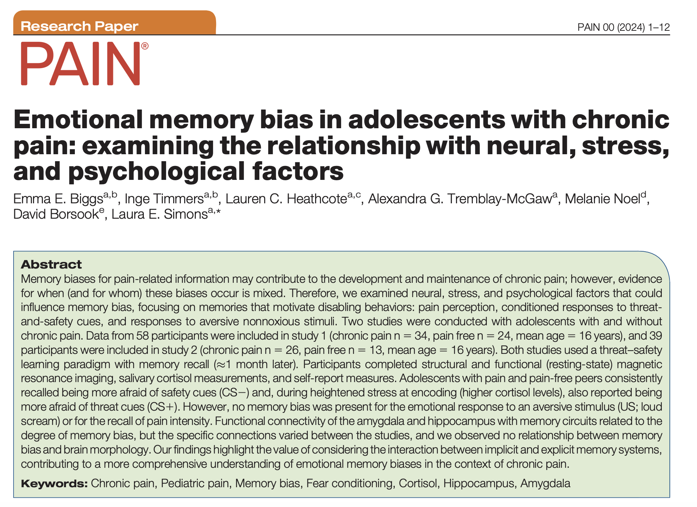

***

__Tremblay-McGaw, A.G.__, Biggs, E.E., Timmers, I., Moulton, E., & Simons, L.E., (in preparation). The role of the cerebellum in threat learning in youth with chronic pain.

__Abstract__

_Coming soon!_

***

__Tremblay-McGaw, A.G.__, Biggs, E.E., Sokol, O., Wiseman Miner, A., Goya Arce, A., & Simons, L.E., (under review). Who is being represented in research? A researcher-driven method for assessing diversity and representation in prospective research cohorts.

__Abstract__

While there are an increasing number of efforts in research methodology to address a lack of representation in research populations, the data needed to facilitate these changes and fully evaluate representation in current research is just emerging. Here we propose a small-scale, inexpensive researcher-driven method of reporting eligible population level characteristics alongside standard participant descriptors in order to generate more robust information about diversity and inclusion that allows researchers to engage and assess these dimensions. As an example, we examined differences between adolescents with chronic pain who decided to enroll in a large biomarker study and those who were eligible but decided not to enroll. Here, we focused on demographics, pain characteristics, emotional functioning, physical functioning, and caregiver profiles. We observed significant differences between our obtained research sample and our population of interest who declined to state race and ethnicity. However, the groups did not differ on any of the other variables of interest. We propose that by reporting who out of the available and eligible population decides to participate in research, readers can better assess the generalizability of findings, and we can begin to address systemic inequities and barriers in research.

***

Fan, J., Woodworth, K., Murphy, K.R., Hinkley, L., Cohen, J.L., Yoshimura, J.,  Choi, J., __Tremblay-McGaw, A.G.__, Mergenthaler, J., Good, C.H., Pellionisz, P.A., Lee, A.M., Ianni, T.D., Sugrue, L.P., & Krystal, A. (2024). Thalamic low intensity focused ultrasound stimulation in treatment resistant depression. Brain Stimulation: Basic, Translational, and Clinical Research in Neuromodulation.

***

Biggs, E.E., Heathcote, L.C., Timmers, I., __Tremblay-McGaw, A.G.__, Noel, M., Borsook, D., & Simons, L.E., (2024). Emotional memory bias in adolescents with chronic pain: examining the relationship with neural, stress,
and psychological factors. PAIN.

***

Timmers, I., Bruckert, L., Biggs, E.E., __Tremblay-McGaw, A.G.__, Borsook, D., Zhang, H., & Simons, L.E. (2024). Probing white matter microstructure in youth with chronic pain and its relation to catastrophizing using neurite orientation dispersion and density imaging. PAIN.

***

Simons, L.E., Hess, C.W., Choate, E.S., Van Orden, A.R., __Tremblay-McGaw, A.G.__, Menendez, M., Boothroyd, D.B., Griffin, A., Parvathinathan, G., Griffin, A., Caruso, T.J., Stinson, J., Weisman, A., Liu, T., Christensen, R., & Koeppen, K., (2022). Virtual Reality Augmented Physiotherapy for Chronic Pain in Youth: Protocol for a randomized controlled trial enhanced with single case experimental design. Journal of Medical Internet Research. 11(12):e40705.
[PDF](pdfs/SimonsEtal2022.pdf)

***

Chanales, A.J.H., __Tremblay-McGaw, A.G.__, Drascher, M.L., & Kuhl, B.A. (2020). Adaptive Repulsion of Long-Term Memory Representations Is Triggered by Event Similarity. Psychological Science. 32 (5), 705-720. [PDF](pdfs/ChanalesEtal2021.pdf)

***

