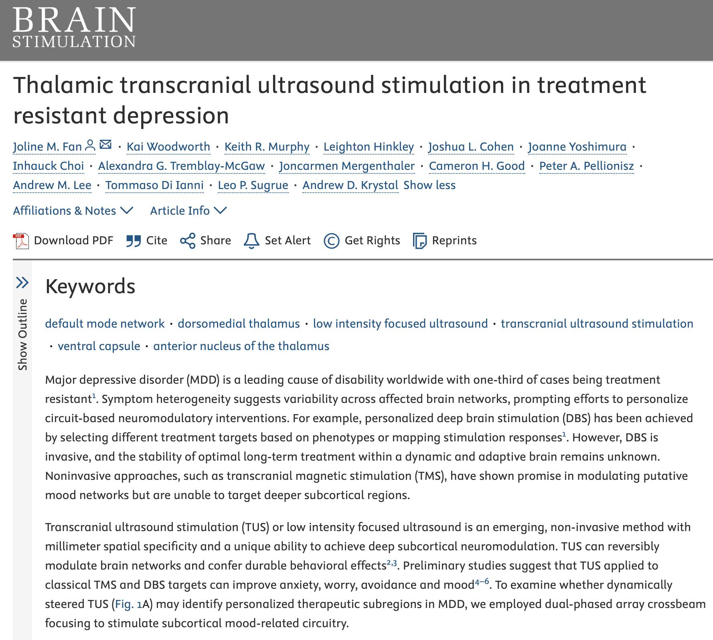

***

__Tremblay-McGaw, A.G.__, Biggs, E.E., Timmers, I., Moulton, E., & Simons, L.E., (in preparation). The role of the cerebellum in threat learning in youth with chronic pain.

__Abstract__

_Coming soon!_

***

__Tremblay-McGaw, A.G.__, Biggs, E.E., Sokol, O., Wiseman Miner, A., Goya Arce, A., & Simons, L.E., (under review). Who is being represented in research? A researcher-driven method for assessing diversity and representation in prospective research cohorts.

__Abstract__

While there are an increasing number of efforts in research methodology to address a lack of representation in research populations, the data needed to facilitate these changes and fully evaluate representation in current research is just emerging. Here we propose a small-scale, inexpensive researcher-driven method of reporting eligible population level characteristics alongside standard participant descriptors in order to generate more robust information about diversity and inclusion that allows researchers to engage and assess these dimensions. As an example, we examined differences between adolescents with chronic pain who decided to enroll in a large biomarker study and those who were eligible but decided not to enroll. Here, we focused on demographics, pain characteristics, emotional functioning, physical functioning, and caregiver profiles. We observed significant differences between our obtained research sample and our population of interest who declined to state race and ethnicity. However, the groups did not differ on any of the other variables of interest. We propose that by reporting who out of the available and eligible population decides to participate in research, readers can better assess the generalizability of findings, and we can begin to address systemic inequities and barriers in research.

***

Fan, J., Woodworth, K., Murphy, K.R., Hinkley, L., Cohen, J.L., Yoshimura, J.,  Choi, J., __Tremblay-McGaw, A.G.__, Mergenthaler, J., Good, C.H., Pellionisz, P.A., Lee, A.M., Ianni, T.D., Sugrue, L.P., & Krystal, A. (2024). Thalamic low intensity focused ultrasound stimulation in treatment resistant depression. Brain Stimulation: Basic, Translational, and Clinical Research in Neuromodulation.

__Abstract__

Major depressive disorder (MDD) is a leading cause of disability worldwide with one-third of cases being treatment resistant. Symptom heterogeneity suggests variability across affected brain networks, prompting efforts to personalize circuit-based neuromodulatory interventions. For example, personalized deep brain stimulation (DBS) has been achieved by selecting different treatment targets based on phenotypes or mapping stimulation responses1. However, DBS is invasive, and the stability of optimal long-term treatment within a dynamic and adaptive brain remains unknown. Noninvasive approaches, such as transcranial magnetic stimulation (TMS), have shown promise in modulating putative mood networks but are unable to target deeper subcortical regions.
Transcranial ultrasound stimulation (TUS) or low intensity focused ultrasound is an emerging, non-invasive method with millimeter spatial specificity and a unique ability to achieve deep subcortical neuromodulation. TUS can reversibly modulate brain networks and confer durable behavioral effects. Preliminary studies suggest that TUS applied to classical TMS and DBS targets can improve anxiety, worry, avoidance and mood4–6. To examine whether dynamically steered TUS (Fig. 1A) may identify personalized therapeutic subregions in MDD, we employed dual-phased array crossbeam focusing to stimulate subcortical mood-related circuitry.

***

Biggs, E.E., Heathcote, L.C., Timmers, I., __Tremblay-McGaw, A.G.__, Noel, M., Borsook, D., & Simons, L.E., (2024). Emotional memory bias in adolescents with chronic pain: examining the relationship with neural, stress,
and psychological factors. PAIN.

__Abstract__

Memory biases for pain-related information may contribute to the development and maintenance of chronic pain; however, evidence for when (and for whom) these biases occur is mixed. Therefore, we examined neural, stress, and psychological factors that could influence memory bias, focusing on memories that motivate disabling behaviors: pain perception, conditioned responses to threat- and-safety cues, and responses to aversive nonnoxious stimuli. Two studies were conducted with adolescents with and without chronic pain. Data from 58 participants were included in study 1 (chronic pain n 5 34, pain free n 5 24, mean age 5 16 years), and 39 participants were included in study 2 (chronic pain n 5 26, pain free n 5 13, mean age 5 16 years). Both studies used a threat–safety learning paradigm with memory recall (%1 month later). Participants completed structural and functional (resting-state) magnetic resonance imaging, salivary cortisol measurements, and self-report measures. Adolescents with pain and pain-free peers consistently recalled being more afraid of safety cues (CS2) and, during heightened stress at encoding (higher cortisol levels), also reported being more afraid of threat cues (CS1). However, no memory bias was present for the emotional response to an aversive stimulus (US; loud scream) or for the recall of pain intensity. Functional connectivity of the amygdala and hippocampus with memory circuits related to the degree of memory bias, but the specific connections varied between the studies, and we observed no relationship between memory bias and brain morphology. Our findings highlight the value of considering the interaction between implicit and explicit memory systems, contributing to a more comprehensive understanding of emotional memory biases in the context of chronic pain.

***

Timmers, I., Bruckert, L., Biggs, E.E., __Tremblay-McGaw, A.G.__, Borsook, D., Zhang, H., & Simons, L.E. (2024). Probing white matter microstructure in youth with chronic pain and its relation to catastrophizing using neurite orientation dispersion and density imaging. PAIN.

__Abstract__

Chronic pain is common in young people and can have a major life impact. Despite the burden of chronic pain, mechanisms underlying chronic pain development and persistence are still poorly understood. Specifically, white matter (WM) connectivity has remained largely unexplored in pediatric chronic pain. Using diffusion-weighted imaging, this study examined WM microstructure in adolescents (age M = 15.8 years, SD = 2.8 years) with chronic pain (n = 44) compared with healthy controls (n = 24). Neurite orientation dispersion and density imaging modeling was applied, and voxel-based whole-white-matter analyses were used to obtain an overview of potential alterations in youth with chronic pain and tract-specific profile analyses to evaluate microstructural profiles of tracts of interest more closely. Our main findings are that (1) youth with chronic pain showed widespread elevated orientation dispersion compared with controls in several tracts, indicative of less coherence; (2) signs of neurite density tract-profile alterations were observed in several tracts of interest, with mainly higher density levels in patients; and (3) several WM microstructural alterations were associated with pain catastrophizing in the patient group. Implicated tracts include both those connecting cortical and limbic structures (uncinate fasciculus, cingulum, anterior thalamic radiation), which were associated with pain catastrophizing, as well as sensorimotor tracts (corticospinal tract). By identifying alterations in the biologically informative WM microstructural metrics orientation dispersion and neurite density, our findings provide important and novel mechanistic insights for understanding the pathophysiology underlying chronic pain. Taken together, the data support alterations in fiber organization as a meaningful characteristic, contributing process to the chronic pain state.

***

Simons, L.E., Hess, C.W., Choate, E.S., Van Orden, A.R., __Tremblay-McGaw, A.G.__, Menendez, M., Boothroyd, D.B., Griffin, A., Parvathinathan, G., Griffin, A., Caruso, T.J., Stinson, J., Weisman, A., Liu, T., Christensen, R., & Koeppen, K., (2022). Virtual Reality Augmented Physiotherapy for Chronic Pain in Youth: Protocol for a randomized controlled trial enhanced with single case experimental design. Journal of Medical Internet Research. 11(12):e40705.
[PDF](pdfs/SimonsEtal2022.pdf)

__Abstract__

Chronic musculoskeletal (MSK) pain is a prominent health concern, resulting in pain-related disability, loss of functioning and high healthcare costs. Physiotherapy rehabilitation is a gold standard treatment for improving functioning in youth with chronic MSK. However, increasing physical activity can feel unattainable for many adolescents due to pain related fear and movement avoidance. Virtual reality (VR) offers an immersive experience that can interrupt the fear-avoidance cycle and improve engagement in physiotherapy. Despite promising initial findings, data are limited and often lack the rigor required to establish VR as an evidence-based treatment for MSK pain. This trial evaluates pain rehabilitation virtual reality (PRVR) for adolescents with MSK pain. This protocol paper outlines the rationale, design, and implementation of a two-group randomized control trial (RCT) enhanced with Single Case Experimental Design (SCED). The objective of this RCT is to test this advancement in VR technology by providing new treatment solutions targeting nonpharmacological movement facilitation. Primary outcomes include physical function and engagement in VR. Secondary outcomes include pain-related fear and treatment adherence. Significant breakthroughs for treating MSK pain require mechanistically informed innovative approaches. PRVR provides exposure to progressive challenge, real-time feedback, reinforcement for movement and can include activities difficult to achieve in the real world. It has the added benefits of sustaining patient motivation and adherence while enabling clinicians to use objective benchmarks to influence progression. These findings will inform the decision of whether to proceed with a hybrid effectiveness-dissemination trial of PRVR, serving as the basis for potential large-scale implementation of PRVR.

***

Chanales, A.J.H., __Tremblay-McGaw, A.G.__, Drascher, M.L., & Kuhl, B.A. (2020). Adaptive Repulsion of Long-Term Memory Representations Is Triggered by Event Similarity. Psychological Science. 32 (5), 705-720. [PDF](pdfs/ChanalesEtal2021.pdf)

__Abstract__

We tested whether similarity between events triggers adaptive biases in how those events are remembered. We generated pairs of competing objects that were identical except in color and varied the degree of color similarity for the competing objects. Subjects (N = 123 across four experiments) repeatedly studied and were tested on associations between each of these objects and corresponding faces. As expected, high color similarity between competing objects created memory interference for object–face associations. Strikingly, high color similarity also resulted in a systematic bias in how the objects themselves were remembered: Competing objects with highly similar colors were remembered as being further apart (in color space) than they actually were. This repulsion of color memories increased with learning and served a clear adaptive purpose: Greater repulsion was associated with lower associative-memory interference. These findings reveal that similarity between events triggers adaptive-memory distortions that minimize interference.

***
