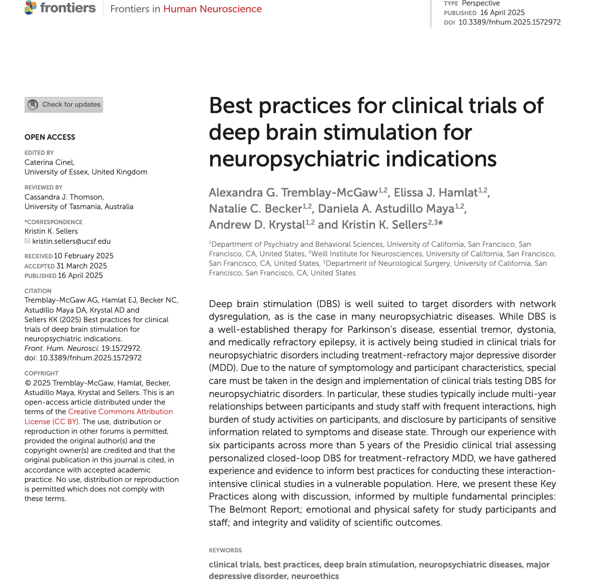
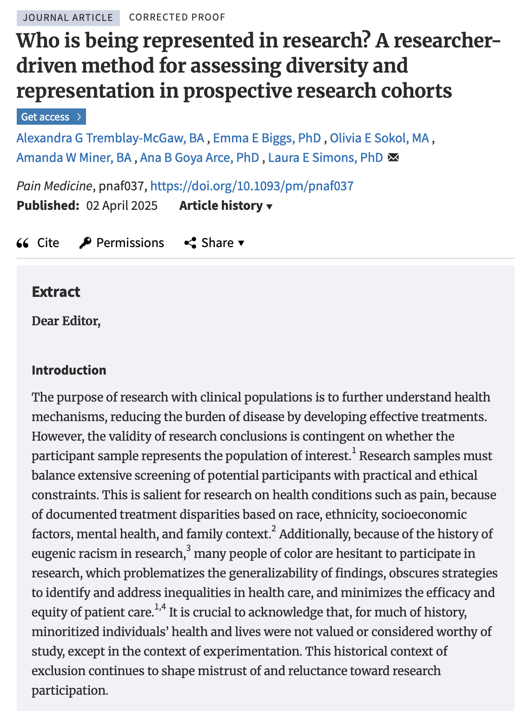
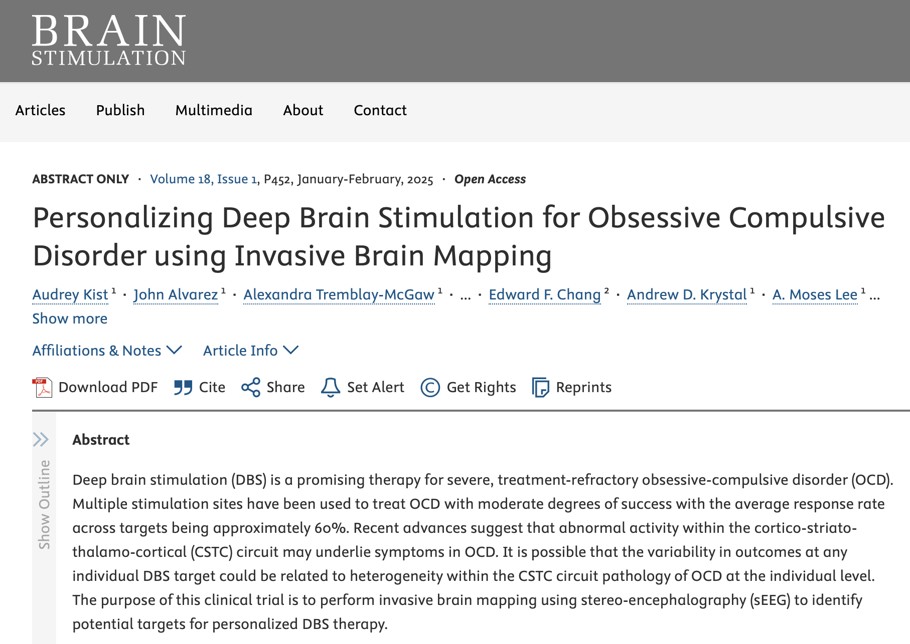
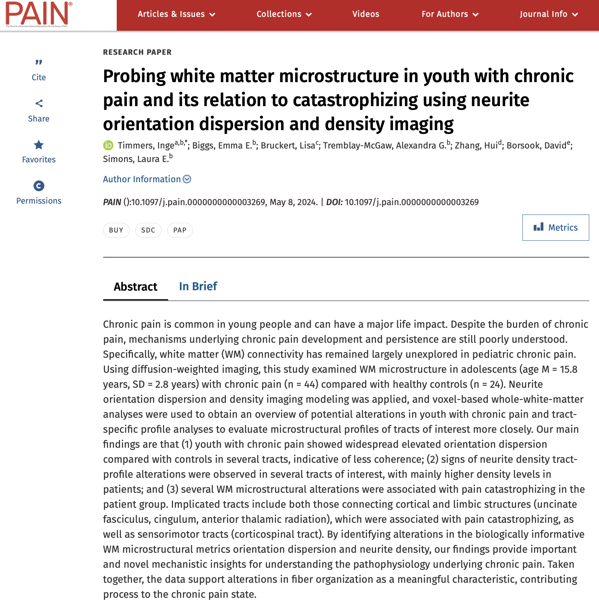

[Google Scholar](https://scholar.google.com/citations?view_op=list_works&hl=en&hl=en&user=VrUzSZ8AAAAJ)

***

__Tremblay-McGaw, A.G.__, Sellers, K., Khambhati, A., Hamlat, E., & Krystal, A. (in preparation). Identification of symptom variability within Major Depression Disorder.

__Abstract__

_Coming soon!_

***

__Tremblay-McGaw, A.G.__, Allawala, A., Sellers, K., Khambhati, A., Astudillo Maya, D., & Krystal, A. (in preparation). An integrative approach for personalized deep brain stimulation using multimodal behavior, neurophysiological signals, and stimulation. 

__Abstract__

_Coming soon!_

***

__Tremblay-McGaw, A.G.__, Biggs, E.E., Timmers, I., Moulton, E., & Simons, L.E. (in preparation). The role of the cerebellum in threat learning in youth with chronic pain.

__Abstract__

_Coming soon!_

***

Sellers, K., Sugrue, L.P., __Tremblay-McGaw, A.G.__, Becker, N., Nedelec, P., Hamlat, E., Chang, E., & Krystal, A.D. (under review). Bladder control side-effects of deep brain stimulation for major depressive disorder related to recruitment of distinct subcomponents of the anterior limb of the internal capsule.

__Abstract__

_Coming soon!_

***

Sellers, K.K., Hamlat, E.J., Choi, I., Astudillo Maya, D.A., __Tremblay-McGaw, A.G.__, Mergenthaler, J., Chang, E.F., & Krystal, A.D. (under review). Sustained benefit of closed-loop deep brain stimulation for major depressive disorder.

__Abstract__

_Coming soon!_

***

Lee, A. Moses, Kist, A., Alvarez, J., Sellers, K. K., Khambhati, A. N., Sugrue, L. P., Reid, L. B., Kadlec, K., Fan, J. M., Allawala, A. B., Racine, C. A., Norbu, T., Astudillo, D., __Tremblay-McGaw, A.G.__, Becker, N., Alhourani, A., Starr, P. A., Chang, E. F., & Krystal, A.D. (under review). Invasive Brain Mapping Identifies Personalized Therapeutic Neuromodulation Targets for Obsessive-Compulsive Disorder.

__Abstract__

_Coming soon!_

***

 __Tremblay-McGaw, A.G.__, Hamlat, E., Becker, N., Astudillo Maya, D., Krystal, A., & Sellers, K., (under review). Best practices for clinical trials of deep brain stimulation for neuropsychiatric indications.Frontiers in Human Neuroscience, Brain Imaging and Stimulation. 
[Link](https://www.frontiersin.org/journals/human-neuroscience/articles/10.3389/fnhum.2025.1572972/full)

***

__Tremblay-McGaw, A.G.__, Biggs, E.E., Sokol, O., Wiseman Miner, A., Goya Arce, A., & Simons, L.E. (2025). Who is being represented in research? A researcher-driven method for assessing diversity and representation in prospective research cohorts. Pain Medicine. [Link](https://academic.oup.com/painmedicine/advance-article-abstract/doi/10.1093/pm/pnaf037/8104054)

***

Kist, A., Alvarez, J., --Tremblay-McGaw, A.G.--, Becker, N., Allawala, A., Fan, J., Khambhati, A.N., Norbu, T., Sugrue, L., Sellers, K.K., Starr, P.A., Chang, E.F., Krystal, A.D., & Lee, A.M. (2025). Personalizing deep brain stimulation for obsessive compulsive disorder using invasive brain mapping. Brain Stimulation: Basic, Translational, and Clinical Research in Neuromodulation, 18(1), 452. Elsevier. [Link](https://www.brainstimjrnl.com/article/S1935-861X(24)00893-3/fulltext)

***

Fan, J., Woodworth, K., Murphy, K.R., Hinkley, L., Cohen, J.L., Yoshimura, J.,  Choi, J., __Tremblay-McGaw, A.G.__, Mergenthaler, J., Good, C.H., Pellionisz, P.A., Lee, A.M., Ianni, T.D., Sugrue, L.P., & Krystal, A. (2024). Thalamic low intensity focused ultrasound stimulation in treatment resistant depression. Brain Stimulation: Basic, Translational, and Clinical Research in Neuromodulation.
[PDF](pdfs/Fanetal.pdf)

***

Biggs, E.E., Heathcote, L.C., Timmers, I., __Tremblay-McGaw, A.G.__, Noel, M., Borsook, D., & Simons, L.E. (2024). Emotional memory bias in adolescents with chronic pain: examining the relationship with neural, stress,
and psychological factors. PAIN. [Link](https://journals.lww.com/pain/abstract/2025/03000/emotional_memory_bias_in_adolescents_with_chronic.10.aspx?context=featuredarticles&collectionid=1)

***

Timmers, I., Bruckert, L., Biggs, E.E., __Tremblay-McGaw, A.G.__, Borsook, D., Zhang, H., & Simons, L.E. (2024). Probing white matter microstructure in youth with chronic pain and its relation to catastrophizing using neurite orientation dispersion and density imaging. PAIN. [Link](https://journals.lww.com/pain/abstract/2024/11000/probing_white_matter_microstructure_in_youth_with.12.aspx)

***

Simons, L.E., Hess, C.W., Choate, E.S., Van Orden, A.R., __Tremblay-McGaw, A.G.__, Menendez, M., Boothroyd, D.B., Griffin, A., Parvathinathan, G., Griffin, A., Caruso, T.J., Stinson, J., Weisman, A., Liu, T., Christensen, R., & Koeppen, K. (2022). Virtual Reality Augmented Physiotherapy for Chronic Pain in Youth: Protocol for a randomized controlled trial enhanced with single case experimental design. Journal of Medical Internet Research. 11(12):e40705.
[PDF](pdfs/SimonsEtal2022.pdf)

***

Chanales, A.J.H., __Tremblay-McGaw, A.G.__, Drascher, M.L., & Kuhl, B.A. (2020). Adaptive Repulsion of Long-Term Memory Representations Is Triggered by Event Similarity. Psychological Science. 32 (5), 705-720. [PDF](pdfs/ChanalesEtal2021.pdf)

***

