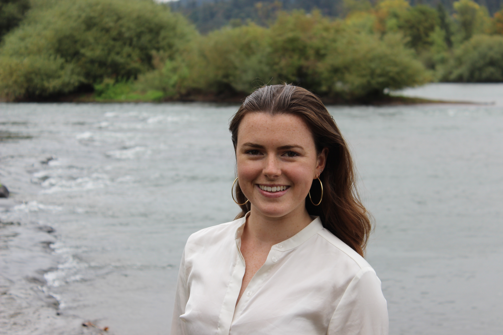

---
title: "Welcome"
---
***

Hi! I'm Alex, a lab manager in the [Kuhl Lab](https://kuhllab.com/) at the [_University of Oregon_](https://www.uoregon.edu/).

I am currently working on collecting fMRI and EEG data and learning MatLab for data collection and analysis. I am planning on going to graduate school to pursue a PhD in clinical psychology. Outside the lab, I enjoy kickboxing, cooking, and everything outdoors.

You can contact me [here](mailto:atrembla@uoregon.edu) or find me on [LinkedIn](https://www.linkedin.com/in/alexandra-tremblay-mcgaw-a28774ba).

***